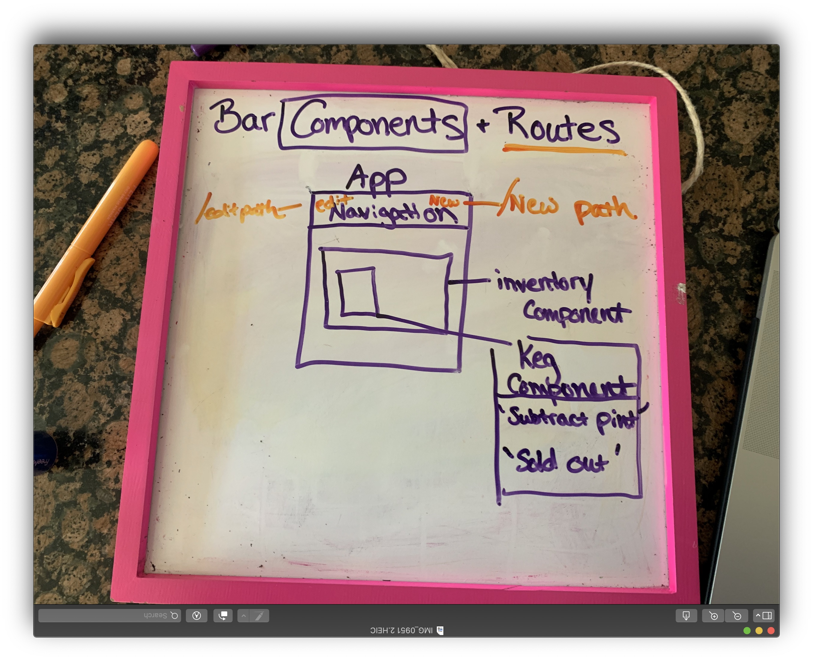

# _2 Part React Code Review_
### _Part 1_
#### _React Fundamentals_
****************
## _February 14, 2020_
****************
#### _By: Joann Carter_
***************
# _Description_
This is a static application for a bar that will demonstrate the basic structure of react.

#  _Specification Chart_
* NOTE: There are plenty more components than originally planned.
******************

******************

******************
******************
#### _Instructions_
* open project
* run 'npm install'
* run 'npm run start'
* open 'http://localhost:3000'
***************
#### _Known Bugs_
* This app is currently static
***************
# _Technology Used_
* React
* Google Fonts
* Google Images
* CSS
*******
###### _Licensing_
MIT public
